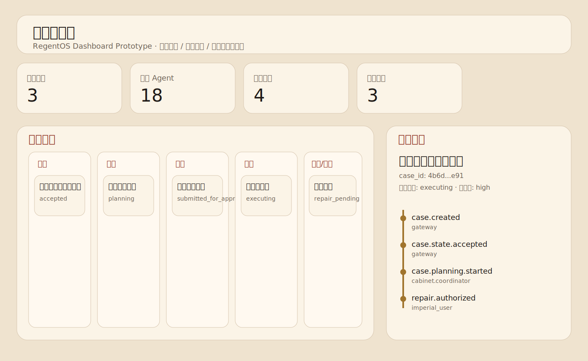

# RegentOS · 内阁治理型多智能体系统

RegentOS 不是一个“让多个 Agent 讨论后交结果”的协作框架。
它是一套把任务转成案件、把生成转成票拟、把执行纳入审批、把异常纳入监督、把修复纳入命令链的治理型多智能体系统原型。

> 声明：当前仓库仅是原型骨架，并不能直接投入实际使用，后续会持续更新。

它首先关心的不是“Agent 怎么分工更快”，而是下面五个问题：

- 谁负责把原始任务解释成可执行方案
- 谁负责批准执行
- 谁负责在执行过程中持续监督
- 谁负责定位问题并提出修复建议
- 谁有权最终批准修复

换句话说，RegentOS 先定义权力关系，再定义执行关系。

详细设计见 [docs/architecture.md](docs/architecture.md)。
接口设计见 [docs/api.md](docs/api.md)。
界面设计见 [docs/dashboard-mvp.md](docs/dashboard-mvp.md)。
快速上手见 [docs/getting-started.md](docs/getting-started.md)。
案例示例见 [examples/README.md](examples/README.md)。

## 我们要解决的问题

大多数多智能体系统已经能做分工、协作和工具调用，但一旦任务变长、风险变高、执行链变复杂，就会暴露四个问题：

1. 生成和批准混在一起
   写方案的人往往也默认推动执行，缺少独立审批门。
2. 批准和监督混在一起
   方案一旦被放行，系统通常只看最终结果，很少有独立的过程监督层。
3. 发现问题和修复问题混在一起
   一旦异常，常见做法是直接重试，很难回答根因在哪、影响范围多大、谁批准了修复。
4. 人工干预没有正式入口
   人可以手动打断系统，但很难以正式命令的方式暂停、冻结、返工或授权修复。

RegentOS 的设计目标，就是把这四个问题拆开处理。

## 五层治理结构

### 1. 通政司（Gateway / Case Intake）

通政司不负责生成方案，也不负责审批。
它负责把用户输入变成一个可以流转、可以编号、可以追踪的案件对象。

它解决的问题是：如果不先案件化，后面的审批、监督、返工和归档都没有统一起点。

当前工程锚点：

- `Case Registry`
- `Event Bus`
- `create_case` 接口

### 2. 内阁（Planning and Coordination）

内阁在 RegentOS 里不是普通的 planner。

这里的“票拟”指的是：把原始旨意转写成一份可以被审批、可以被执行、可以被追责的正式执行草案。

票拟至少完成四件事：

1. 解释目标，把模糊任务转成明确目标
2. 拆解步骤，把目标转成可执行子任务
3. 排列顺序，明确依赖关系、并行关系和返工入口
4. 形成待批版本，整理成一份可提交给司礼监审查的正式稿

所以，内阁负责的是任务解释、方案起草、执行协调和结果回奏。

当前工程锚点：

- `core/orchestrator/engine.py`
- `agents/cabinet/coordinator/SOUL.md`

### 3. 司礼监（Approval Gate）

司礼监负责的不是生成，而是决定“这个方案能不能做”。

它的职责包括：

- 审查票拟稿是否完整
- 判断步骤是否越界
- 判断风险是否可接受
- 批准、驳回或要求补证
- 形成正式批令

这里的“封驳”不是简单提建议，而是正式退回，不允许方案直接进入执行。

所以，司礼监解决的是：生成不等于批准。

当前工程锚点：

- `submitted_for_approval -> approved / rejected`
- `agents/silijian/approver/SOUL.md`

### 4. 台谏院（Oversight Layer）

审批通过，不代表执行过程一定正确。

台谏院的职责是：

- 监督执行链是否跳步
- 监督是否绕过审批
- 监督工具和资源使用是否异常
- 监督结果是否偏离原方案
- 记录违规、滞塞和异常事件

它不负责写方案，也不负责批准。
它负责的是：执行过程中有没有偏航。

所以，台谏院解决的是：批准不等于监督。

当前工程锚点：

- 权限矩阵草案
- 状态机保护
- `agents/censorship/inspector/SOUL.md`

### 5. 锦衣卫（Repair Advisory Layer）

锦衣卫不直接修复。

它负责：

- 定位问题在哪个 Agent、哪个模块、哪个步骤
- 判断影响是否扩散到其他模块
- 评估风险等级
- 提出补丁、回滚、重跑建议

但它不能直接修改系统。
修复必须由用户下达正式修复令。

所以，锦衣卫解决的是：发现问题不等于有权修复。

当前工程锚点：

- `repair_pending -> repair_authorized`
- `repair-order` 接口
- `agents/jinyiwei/advisor/SOUL.md`

## 关键术语

- **案件化**：把原始任务变成一个有 `case_id`、状态、时间线和元信息的正式对象。
- **票拟**：把原始旨意转成可审批、可执行、可追责的正式草案。
- **封驳**：方案不合格时，正式退回返工，而不是仅给出 warning。
- **稽察**：对执行过程做独立监督，检查跳步、越权、滞塞和偏航。
- **修复受令**：可以自动发现问题、自动分析问题、自动提出修复建议，但不能自动修改系统；修复必须有用户命令。

## 四个分离原则

- 生成权和批准权分离
- 批准权和监督权分离
- 监督权和修复建议权分离
- 修复建议权和修复执行权分离

这四个分离，是 RegentOS 的核心设计。

## 系统主流程

```text
用户
→ 通政司（案件化）
→ 内阁（票拟）
→ 司礼监（审批 / 封驳）
→ 执行层（动态执行池，规划中）
→ 台谏院（全过程监督）
→ 锦衣卫（异常诊断与修复建议）
→ 用户（批准修复 / 重跑 / 冻结 / 终止）
```

这条链不是为了“更复杂”，而是为了让长链条任务具备正式的审批、监督、返工和修复闭环。

## 当前状态

### 已实现

- `FastAPI` 原型接口
- 案件注册表与时间线
- 内存版 `Event Bus`
- 基础状态机与非法跳转保护
- 基础权限矩阵草案
- 最小编排器
- 4 个关键治理角色的 `SOUL.md`
- 状态机测试
- 演示数据脚本
- `agents.json` manifest
- React Dashboard 原型
- 安装脚本与配置样例
- 持久化 demo 数据快照

### 开发中

- 更完整的审批 / 封驳 / 返工闭环
- 更细的案件约束和错误处理
- 更完整的卷宗导出与回放

### 规划中

- 动态执行池的真实实现
- 更完整的文渊阁中枢控制台
- Redis Streams / NATS 等真实事件总线
- 模型注册与热切换
- Skills Registry
- 风险策略 DSL
- 多租户与移动端支持

## 模型接入策略

18 个固定治理 Agent 的设计目标，不是只能接远程 API。
每个 Agent 最终都应该可以独立绑定三类模型来源：

- 远程 API 模型
- 本地蒸馏 / 量化 / 专项配置模型
- 本地完整大模型

系统设计本身不限制本地模型大小。
真正的上限取决于你的本机硬件、推理后端、量化方式、上下文长度和运行配置。

这意味着 RegentOS 不强迫你把治理层全部托管到云端，也不强迫你只能跑轻量模型。

## 我们和常见多智能体框架的区别

常见多智能体框架的重点通常是：

- 角色分工
- 协作对话
- 工具调用
- 任务完成

RegentOS 的重点是：

- 票拟是否成立
- 审批是否通过
- 执行过程是否偏航
- 异常是否被正式记录
- 修复是否得到授权

也就是说：

**别人主要解决“怎么做事”。**
**RegentOS 主要解决“做事之后谁审批、谁监督、谁诊断、谁批准修复”。**

## 我们和 `edict` 的侧重点差异

公开可见的 [`edict`](https://github.com/cft0808/edict) 首页更强调一条较短的制度化编排链，以及 Demo、实时看板、Docker 体验、模型切换、技能管理和审计展示。

RegentOS 的重点不同。
我们不是把制度隐喻主要用于任务分发，而是把制度原理用于治理分权：

- 内阁负责票拟，不负责最终批准
- 司礼监负责批准，不负责监督执行
- 台谏院负责监督，不负责技术诊断
- 锦衣卫负责诊断，不负责自动修复
- 用户保留最终修复权

所以，`edict` 更像制度化编排系统；
RegentOS 更像治理型多智能体操作系统。

这不是“谁更高级”，而是关注点不同：

- 前者更强调编排效率、演示完整度和部署体验
- 后者更强调权力边界、异常闭环和修复主权

## 仓库里现在有什么

| 模块 | 当前作用 |
|------|-----------|
| `apps/api` | 提供案件创建、查询、时间线与人工干预接口 |
| `core/registry` | 管理案件对象、状态和元信息 |
| `core/events` | 提供内存事件总线与事件 schema |
| `core/state_machine` | 维护合法状态转换 |
| `core/permissions` | 维护角色消息权限矩阵 |
| `core/orchestrator` | 驱动最小案件流转 |
| `core/replay` | 导出案件时间线 JSON |
| `agents/*/SOUL.md` | 定义关键治理角色的职责边界 |
| `scripts/seed_demo_data.py` | 生成原型演示数据 |

## v0.1 的 MVP 截断线

这个仓库当前不追求“一次把所有制度层、执行层和控制台都做完”，而是先把下面 5 件事做扎实：

1. 案件创建与状态流转
2. 司礼监审批 / 封驳骨架
3. 台谏院异常监督骨架
4. 锦衣卫修复建议与修复受令骨架
5. 最小卷宗时间线与导出

更完整的 `文渊阁中枢` 看板仍属于下一阶段；当前仓库已经提供基于 React 的前端原型。

## 快速开始

### 一键安装

```bash
chmod +x install.sh
./install.sh
```

安装脚本会自动：

- 创建 `.venv`
- 安装依赖
- 安装 Dashboard 前端依赖并完成构建
- 初始化 `runtime/` 与 `data/`
- 导出 `agents.json`
- 生成并加载 `data/demo_cases.json`

### 本地运行

```bash
source .venv/bin/activate
bash scripts/run_api.sh
bash scripts/run_dashboard.sh
```

默认访问：

- `GET http://127.0.0.1:8000/healthz`
- `GET http://127.0.0.1:8000/api/cases`
- `POST http://127.0.0.1:8000/api/cases`
- `GET http://127.0.0.1:8000/api/agents`
- `GET http://127.0.0.1:8000/api/dashboard/summary`
- `GET http://127.0.0.1:8000/api/models/runtime-capabilities`
- `http://127.0.0.1:7891`

如果你想分别手动启动：

```bash
source .venv/bin/activate
uvicorn apps.api.main:app --reload
python apps/dashboard/server.py --host 0.0.0.0 --port 7891 --api-base http://127.0.0.1:8000
```

### 演示数据

```bash
python scripts/seed_demo_data.py
```

### 运行测试

```bash
pytest tests
```

### Docker

```bash
docker compose up
```

现在 `docker-compose.yml` 已包含 API、worker 和 React Dashboard 开发服务。

### React 前端开发模式

```bash
cd apps/dashboard
npm install
VITE_API_BASE=http://127.0.0.1:8000 npm run dev -- --host 0.0.0.0 --port 7891
```

## 最小接口示例

### 创建案件

```bash
curl -X POST http://127.0.0.1:8000/api/cases \
  -H "Content-Type: application/json" \
  -d '{
    "title": "企业知识库系统设计",
    "content": "FastAPI + PostgreSQL + 全文搜索 + 权限分级",
    "priority": "high",
    "submitted_by": "imperial_user"
  }'
```

### 查看时间线

```bash
curl http://127.0.0.1:8000/api/cases/{case_id}/timeline
```

### 推进最小流转

```bash
curl -X POST http://127.0.0.1:8000/api/cases/{case_id}/accept
curl -X POST http://127.0.0.1:8000/api/cases/{case_id}/submit-for-approval
curl -X POST http://127.0.0.1:8000/api/cases/{case_id}/approve
```

如需模拟封驳或异常：

```bash
curl -X POST http://127.0.0.1:8000/api/cases/{case_id}/reject \
  -H "Content-Type: application/json" \
  -d '{"reason": "测试覆盖不足"}'

curl -X POST http://127.0.0.1:8000/api/cases/{case_id}/repair-pending \
  -H "Content-Type: application/json" \
  -d '{"reason": "dependency corruption"}'
```

### 人工干预

```bash
curl -X POST http://127.0.0.1:8000/api/cases/{case_id}/pause
curl -X POST http://127.0.0.1:8000/api/cases/{case_id}/resume
curl -X POST http://127.0.0.1:8000/api/cases/{case_id}/freeze
curl -X POST http://127.0.0.1:8000/api/cases/{case_id}/cancel
curl -X POST http://127.0.0.1:8000/api/cases/{case_id}/repair-order \
  -H "Content-Type: application/json" \
  -d '{
    "strategy": "patch_then_rerun",
    "reason": "critical dependency issue",
    "scope": "executor_pool/api_builder"
  }'
```

## 状态机

主流程：

```text
created
→ accepted
→ planning
→ internal_review
→ submitted_for_approval
→ approved / rejected / escalated
→ dispatched
→ executing
→ reporting
→ archived
```

异常分支：

```text
executing
→ repair_pending
→ repair_authorized
→ rerunning
→ executing
```

核心约束：

- 未经 `approved`，不得进入 `dispatched`
- 未经 `repair_authorized`，不得进入 `rerunning`
- 非法状态跳转会被拒绝

## 固定治理角色

RegentOS 的长期设计目标是 18 个固定治理 Agent，但它们不再作为首页第一卖点。
当前首页只强调治理分权主线；更完整的角色编制属于扩展设计。
完整的结构化清单可见仓库根目录 [agents.json](agents.json)。

<details>
<summary><b>查看 18 个固定治理 Agent 设计稿</b></summary>

### 通政司

- 受理建档
- 卷宗登记

### 内阁

- 首辅协调
- 票拟草拟
- 校核复审
- 执行调度
- 回奏反馈

### 司礼监

- 掌印审批
- 秉笔批令
- 封驳记录

### 台谏院

- 吏科监察
- 户科监察
- 礼科监察
- 兵科监察
- 刑科监察
- 工科监察
- 都察总巡

### 锦衣卫

- 问题定位
- 影响分析
- 修复建议

</details>

## 开发路线

### 第一阶段：基础控制面

- `core/state_machine`
- `core/permissions`
- `core/events`
- `apps/api/main.py`

### 第二阶段：治理角色骨架

- `core/orchestrator`
- `agents/cabinet`
- `agents/silijian`
- `agents/censorship`
- `agents/jinyiwei`

### 第三阶段：界面与回放

- 文渊阁中枢
- 更完整的卷宗回放
- 可观测性与审计增强

## 仓库入口

- [agents.json](agents.json)：18 个固定治理 Agent manifest
- [config/.env.example](config/.env.example)：环境变量样例
- [config/model-bindings.example.json](config/model-bindings.example.json)：模型绑定样例
- [docs/getting-started.md](docs/getting-started.md)：5 分钟上手
- [examples/README.md](examples/README.md)：示例案件
- [apps/dashboard/README.md](apps/dashboard/README.md)：文渊阁中枢说明

## 文渊阁中枢预览



## 为什么坚持“修复受令”

许多系统会把“发现问题”和“修复问题”自动串起来。
这样虽然高效，但责任不清。

RegentOS 坚持：

- 可以自动发现问题
- 可以自动分析影响
- 可以自动提出修复建议
- 但不能自动修改系统

因为在高风险任务里，修复本身也是一种需要审批的动作。

## 适用场景

- 长链条代码生成与重构
- 需要审批和返工的软件交付任务
- 多工具、多服务、多模块的执行链
- 需要正式审计与归档的企业流程
- 高风险自治系统
- 需要强监督、强诊断、强修复边界的 AI 平台

## 项目方向

RegentOS 不追求“最像一个团队协作工具”。
它追求的是：

- 任务可案件化
- 流程可审批
- 执行可监督
- 异常可诊断
- 修复可受令
- 全程可追责

这是一个治理型系统，而不只是一个协作型系统。

## License

MIT
