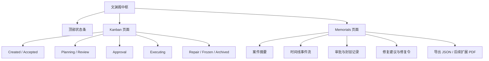
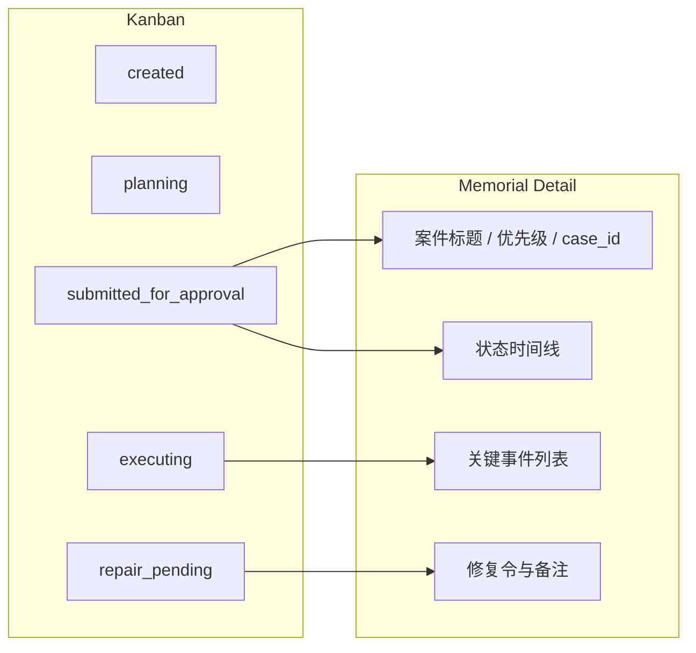

# Dashboard MVP

## 目标

v0.1 的界面目标不是一次做出完整控制台，而是先把两件最关键的东西可视化：

- `Kanban`：看见案件当前在哪个状态
- `Memorials`：看见案件卷宗和时间线

这份文档既是 `文渊阁中枢` 的最小设计稿，也是当前 React 原型的说明文档。

## 页面范围

### 1. Kanban

展示：

- 案件编号
- 标题
- 当前状态
- 优先级
- 最近更新时间
- 可用干预动作

### 2. Memorials

展示：

- 原始旨意
- 状态时间线
- 关键事件
- 修复令
- 导出入口

## 数据来源

- `/api/cases`
- `/api/cases/{case_id}`
- `/api/cases/{case_id}/timeline`
- `/api/agents`
- `/api/models/runtime-capabilities`

## 页面结构



## 模拟展示图

下面这张图是当前 React 原型所采用的信息布局。



## 前端建议结构

建议目录：

```text
apps/dashboard/
  src/
    pages/
      KanbanPage.tsx
      MemorialsPage.tsx
    components/
      CaseColumn.tsx
      CaseCard.tsx
      TimelinePanel.tsx
      EventList.tsx
      RepairOrderPanel.tsx
    lib/
      api.ts
      mock.ts
```

## MVP 交互

### Kanban

- 点击案件卡片
- 右侧打开卷宗详情
- 从卡片直接触发 `pause / resume / freeze / cancel`

### Memorials

- 按时间顺序展示事件
- 高亮审批、封驳、修复受令事件
- 支持导出 JSON

## 与 18 个 Agent 的关系

Dashboard 不需要在 v0.1 就做出 18 个 Agent 的独立控制面。
但建议至少展示：

- 固定治理 Agent 总数
- 已有骨架的 Agent
- 每个 Agent 的样式类型
- 每个 Agent 支持的模型来源

这样界面就能和 Agent Catalog API 对齐。
